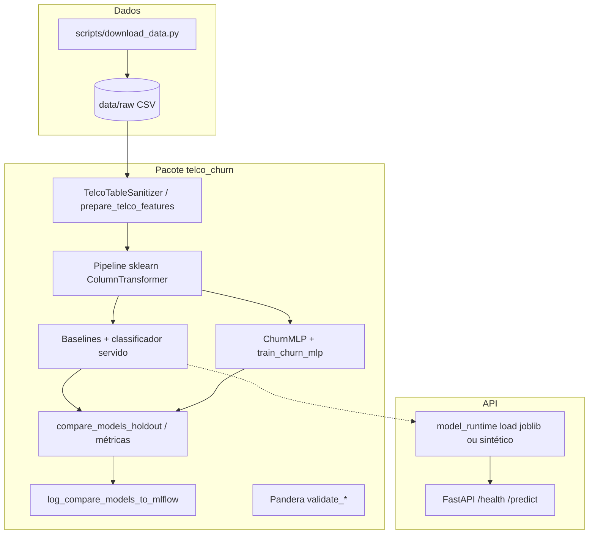

# Tech Challenge FIAP — Churn (Telco)

## Descrição do projeto

Pipeline **end-to-end** para **previsão de churn** em dados tabulares públicos (**IBM Telco Customer Churn**): EDA e baselines (Scikit-learn), **MLP** em PyTorch com early stopping, comparação de modelos e registro no **MLflow**, pacote em `src/`, validação com **Pandera**, **API FastAPI** com logging estruturado e testes com **pytest**, conforme `etapas-tech-challenge.txt`.

Documentação de apoio (Etapa 4): [ML Canvas](docs/ml-canvas.md), [Model Card](docs/model-card.md), [arquitetura de deploy](docs/deploy-architecture.md), [plano de monitoramento](docs/monitoring-plan.md).

---

## Requisitos

| Item | Detalhe |
|------|---------|
| **Python** | 3.9+ (recomendado 3.11+) |
| **Dependências** | Definidas em [`pyproject.toml`](pyproject.toml) (`pip install -e .` ou `make install` / `make dev`) |
| **SO** | Linux, macOS ou Windows (ajuste comandos de `venv` e shell) |

---

## Setup (instalação do zero)

Na raiz do repositório (`tech-challenge-1/`):

```bash
cd tech-challenge-1
python3 -m venv .venv
source .venv/bin/activate   # Windows: .venv\Scripts\activate
make dev
# ou: pip install -U pip && pip install -e ".[dev]"
```

Baixar o dataset para `data/raw/` (arquivo não versionado; veja [`.gitignore`](.gitignore)):

```bash
python scripts/download_data.py
```

Opcional: instalar apenas runtime (sem **ruff**):

```bash
make install
```

---

## Execução

### Qualidade de código e testes

```bash
make lint          # ruff em src/, tests/, scripts/
make test          # pytest (smoke, schema, API)
make check         # lint + test (recomendado antes de commit)
```

### API FastAPI

Sobe **uvicorn** em `http://0.0.0.0:8000` (acesso local: `http://127.0.0.1:8000`):

```bash
make run
```

| Rota | Método | Descrição |
|------|--------|-----------|
| `/health` | GET | Liveness e origem do modelo (`model_source`: ver variáveis abaixo) |
| `/predict` | POST | JSON com pelo menos `tenure`, `MonthlyCharges`; demais colunas alinhadas ao Telco (ver `TelcoInferenceRow` em `src/telco_churn/api/schemas.py`) |
| `/docs` | GET | Swagger UI (OpenAPI) |

### Deploy em nuvem (bônus FIAP — endpoint público)

API servida no **Google Cloud Run** (projeto `tech-challenge-1-495400`, região `southamerica-east1`, serviço `telco-churn-api`):

| | |
|--|--|
| **URL base** | `https://telco-churn-api-3kxqsbcqwq-rj.a.run.app` |
| **Health check** | `GET /health` |

Exemplo (substitua pela URL atual se o serviço for recriado):

```bash
curl -sS "https://telco-churn-api-3kxqsbcqwq-rj.a.run.app/health"
```

Para obter a URL novamente após um novo deploy:

```bash
gcloud run services describe telco-churn-api --region southamerica-east1 \
  --project tech-challenge-1-495400 --format='value(status.url)'
```

**Variáveis de ambiente (ordem de precedência):**

| Variável | Conteúdo do `.joblib` |
|----------|------------------------|
| **`TELCO_MLP_BUNDLE_PATH`** | **`TelcoMlpPredictor`** (MLP PyTorch + pipeline de features Telco). Preferencial para produção alinhada ao desafio. |
| **`TELCO_SKLEARN_PIPELINE_PATH`** | `sklearn.Pipeline` completo (alternativa, ex.: logística servindo só sklearn). |

Se **nenhuma** apontar para um arquivo válido, a API treina uma **MLP pequena em dados sintéticos** ao subir (`model_source`: `default_synthetic_mlp`) — apenas desenvolvimento/testes.

Para gravar um bundle após treinar no notebook ou script Python: `from telco_churn.api.mlp_predictor import TelcoMlpPredictor, save_mlp_predictor` — instanciar com `prep` (features) fitado + `ChurnMLP` treinada; depois `save_mlp_predictor("models/telco_mlp.joblib", predictor)`.

Exemplo de chamada:

```bash
curl -s -X POST "http://127.0.0.1:8000/predict" \
  -H "Content-Type: application/json" \
  -d '{"tenure":12,"MonthlyCharges":53.85,"TotalCharges":"734.35","gender":"Female","Partner":"Yes","PhoneService":"Yes"}'
```

### Notebook e MLflow

```bash
jupyter notebook notebooks/01_eda_baselines.ipynb
```

Tracking local em `mlruns/`:

```bash
mlflow ui --backend-store-uri file:$(pwd)/mlruns
```

### Uso programático do pacote

Com o pacote instalado (`pip install -e .`), o módulo importável é `telco_churn` (código em [`src/telco_churn/`](src/telco_churn/)). Funções úteis: `prepare_telco_features`, `compare_models_holdout`, `compare_models_stratified_cv` (k-fold estratificado OOF, baselines + MLP), `compare_sklearn_baselines_stratified_cv`, `train_churn_mlp`, `log_compare_models_to_mlflow` (ver `src/telco_churn/__init__.py`).

---

## Arquitetura do repositório

Visão em camadas: **dados** → **pré-processamento / features** → **modelagem** (sklearn + PyTorch) → **avaliação e MLflow** → **API**.



- **Deploy em produção:** o desenho alvo (batch diário para CRM + API para casos online) está em [docs/deploy-architecture.md](docs/deploy-architecture.md).  
- **Observabilidade e operação:** [docs/monitoring-plan.md](docs/monitoring-plan.md).  
- **Limitações e métricas de validação:** [docs/model-card.md](docs/model-card.md).

### Estrutura de pastas

| Pasta | Uso |
|--------|-----|
| `src/telco_churn/` | Código do pacote (`data/`, `modeling/`, `training/`, `evaluation/`, `api/`, etc.) |
| `data/raw/` | CSV Telco (gerado pelo script de download) |
| `notebooks/` | EDA, baselines e experimentos |
| `docs/` | ML Canvas, Model Card, deploy, monitoramento |
| `models/` | Artefatos exportados (ex.: `.joblib` para a API) |
| `tests/` | Pytest |
| `scripts/` | Utilitários (`download_data.py`) |
| `mlruns/` | MLflow local (gerado em uso; não versionar em produção sem política) |

---

## Makefile (referência rápida)

| Comando | Descrição |
|--------|------------|
| `make help` | Lista os alvos |
| `make install` | `pip install -e .` |
| `make dev` | `pip install -e ".[dev]"` (inclui **ruff**) |
| `make lint` | `ruff check src tests scripts` |
| `make test` | `pytest tests/` |
| `make run` | API em `:8000` |
| `make check` | `lint` + `test` |

O `Makefile` usa `.venv/bin/python` se existir; caso contrário, `python3`.

---

## Entregas do Tech Challenge (mapa)

| Etapa | Conteúdo principal |
|-------|-------------------|
| 1 | EDA, baselines, ML Canvas, MLflow no notebook |
| 2 | MLP PyTorch, comparação de modelos, trade-off de custo |
| 3 | Refatoração `src/`, pipeline sklearn, API FastAPI, testes, Makefile, ruff |
| 4 | Model Card, deploy batch vs real-time, plano de monitoramento, README (este arquivo); vídeo STAR e deploy em nuvem conforme disciplina ([URL pública](#deploy-em-nuvem-bônus-fiap--endpoint-público)) |

---

## Licença e dados

Dataset **IBM Telco Customer Churn** (uso acadêmico / público conforme fonte). O repositório do desafio segue as regras da instituição para entrega (GitHub + vídeo).
