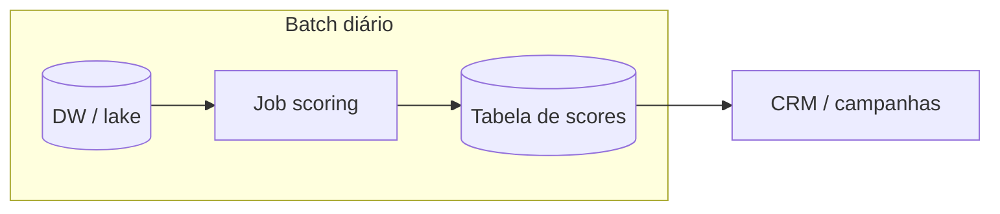
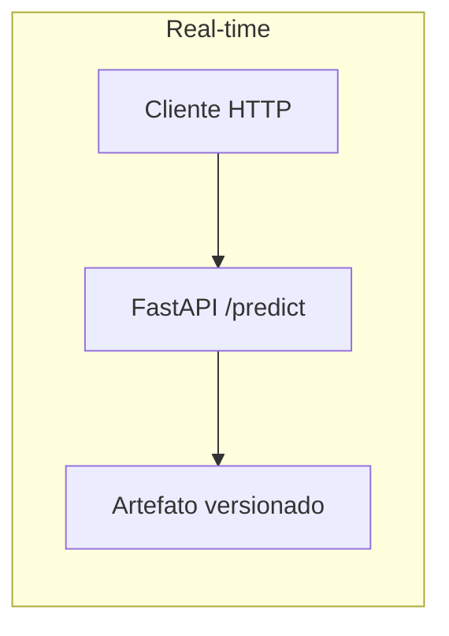

# Arquitetura de deploy — churn Telco (batch vs. real-time)

Documento alinhado a *Ciclo de Vida dos Modelos — Aula 04*: escolha de padrão de servir o modelo em produção, com **comparação** entre **batch** e **real-time** e **justificativa** da arquitetura adotada para este caso de uso. Complementa o [ML Canvas](ml-canvas.md) (SLOs, stakeholders) e o [Model Card](model-card.md) (limitações do artefato servido).

**Versão:** 1.0 (maio/2026)

---

## 1. Contexto da decisão

O problema é **priorizar clientes para retenção** com base em probabilidade de churn. Os stakeholders (CRM, marketing, diretoria) consomem **listas e campanhas** com capacidade limitada de contato; o modelo não precisa, na maioria dos fluxos, responder em milissegundos a cada evento de navegação isolado.

O repositório já expõe uma **API FastAPI** (`/predict`, `/health`) com inferência **síncrona sob demanda** — isso implementa o padrão **real-time** (requisição–resposta). A questão de deploy é **onde** esse padrão se encaixa em relação a um **pipeline batch** que materializa scores para a operação diária.

---

## 2. O que significa cada padrão

| Dimensão | **Batch (escoragem agendada)** | **Real-time (inferência online)** |
|----------|-------------------------------|-------------------------------------|
| **Disparo** | Job agendado (cron, Airflow, Step Functions) ou após ETL | Chamada HTTP/gRPC (cliente, CRM, middleware) |
| **Entrada** | Base completa ou janela incremental (ex.: clientes ativos) | Um registro ou lote pequeno por requisição |
| **Latência** | Minutos a horas aceitáveis para conclusão do job | Baixa por requisição (ex.: p95 &lt; 500 ms — rascunho no ML Canvas) |
| **Escala** | Paralelismo em cluster; custo previsível por janela | Picos de tráfego exigem autoscaling, filas ou rate limit |
| **Versionamento** | Um artefato (`joblib`, ONNX, etc.) por run; fácil auditar “qual modelo gerou esta tabela” | Mesmo artefato carregado no serviço; rollout via blue/green ou nova revisão |
| **Acoplamento** | Forte ao data warehouse / lake | Forte ao gateway e à autenticação da API |

---

## 3. Arquitetura escolhida (produção alvo)

**Escolha principal: deploy em modo batch (complementado por API real-time onde fizer sentido).**

### 3.1 Backbone operacional — batch

1. **Extração:** snapshot diário (ou intradiário) de clientes elegíveis a partir do DW/lake, com as mesmas colunas esperadas pelo pipeline de features.  
2. **Transformação + inferência:** job containerizado (imagem com `telco_churn` ou orquestrador que chama batch script) aplica o pipeline versionado e grava **probabilidade de churn** (+ opcionalmente classe por limiar de negócio).  
3. **Carga:** resultados em tabela analítica, **feature store** ou exportação para o CRM (arquivo ou API de carga do fornecedor).  
4. **Governança:** run id / versão do modelo alinhada ao **MLflow** (ou registro equivalente); artefato servido preferencialmente como **`TELCO_MLP_BUNDLE_PATH`** (`TelcoMlpPredictor`); ver [Model Card](model-card.md).

Fluxo lógico:

### 3.2 Complemento — real-time (API)

Manter o **serviço FastAPI** como **caminho de inferência online** para:

- **Atendimento** (screen-pop): operador consulta risco no momento da ligação.  
- **Canais digitais** que exigem resposta imediata sem depender da última materialização batch.  
- **Homologação e integração** com parceiros que consomem JSON síncrono.

Neste desenho, a API **não substitui** o batch para a carteira inteira: evita N chamadas síncronas para milhões de linhas e reduz custo e risco de indisponibilidade em pico.

---

## 4. Justificativa (por que batch como eixo)

1. **Alinhamento aos SLOs do ML Canvas:** cobertura de scoring **“≥ 99% dos clientes elegíveis com predição diária”** descreve naturalmente um **cadência diária materializada**, não uma chamada online por cliente a cada segundo.  
2. **Operação de retenção:** campanhas trabalham com **listas priorizadas** e orçamento de contato; atualizar scores uma vez por dia (ou por ciclo de ETL) costuma ser suficiente para o ganho de negócio.  
3. **Custo e simplicidade:** um job batch é mais simples de dimensionar, repetir e monitorar (tempo de execução, linhas processadas, taxa de falha) do que manter apenas real-time para toda a base.  
4. **Consistência:** todos os sistemas downstream leem a **mesma versão** do score na janela do dia, o que facilita auditoria e A/B de modelo.  
5. **Risco:** o [Model Card](model-card.md) já registra dependência de artefato e fallbacks; em batch, falhas podem ser **retentadas** e **compensadas** sem expor o cliente final a timeout em massa.

### Quando priorizar real-time em vez de batch

- Regras de negócio que exigem score **após** um evento imediato (ex.: mudança de plano na mesma sessão) e o batch **não** cobre essa latência.  
- Volume baixo e alto valor por interação (ex.: B2B premium), onde latência de minutos do batch seria inaceitável.

Para o cenário típico de **churn em massa em telecom**, esses casos são **exceções** atendidas pelo complemento de API, não pelo desenho principal.

---

## 5. Mapeamento para nuvem (referência)

O Tech Challenge cita deploy opcional em **AWS, Azure ou GCP**. O padrão batch encaixa bem em:

- **Orquestração:** AWS Step Functions + AWS Batch / Lambda com limite de tempo; Azure Data Factory + Azure ML batch endpoint; GCP Cloud Composer + Dataproc / Vertex batch prediction.  
- **Artefato:** bundle `.joblib` com `TelcoMlpPredictor` (`TELCO_MLP_BUNDLE_PATH`) ou pipeline sklearn (`TELCO_SKLEARN_PIPELINE_PATH`); evoluções futuras (ONNX/TorchScript) podem substituir o joblib se decidido.

O padrão real-time encaixa em:

- **Compute:** ECS/Fargate, Azure Container Apps, Cloud Run / GKE com **uvicorn** atrás de load balancer.  
- **Observabilidade:** latência p50/p95, taxa de erro, uso do middleware de latência já previsto na Etapa 3.

---

## 6. Resumo executivo

| Pergunta | Resposta |
|----------|----------|
| **Batch ou real-time?** | **Batch** como arquitetura de deploy **principal** para escorar a base e alimentar CRM; **real-time (FastAPI)** como **complemento** para canais que precisam de inferência sob demanda. |
| **Por quê?** | Campanhas diárias, SLO de cobertura diária, custo e governança; API preserva o entregável técnico e cobre casos de baixa latência sem escanear toda a carteira online. |

Atualizar este documento se os SLOs de negócio mudarem (ex.: scoring intrahorário obrigatório) ou se o artefato servido migrar de sklearn batch-only para stack exclusivamente online.
